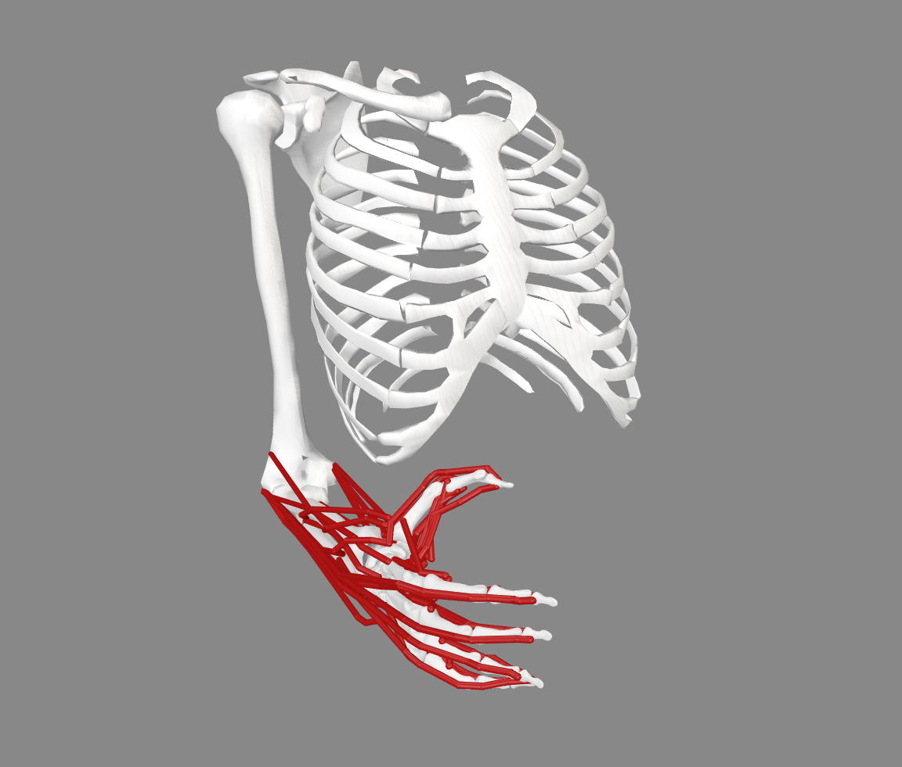
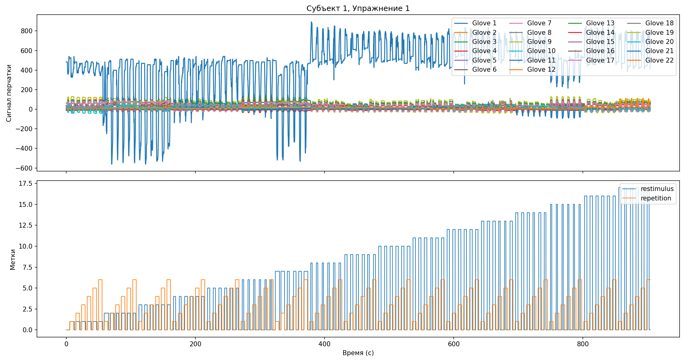
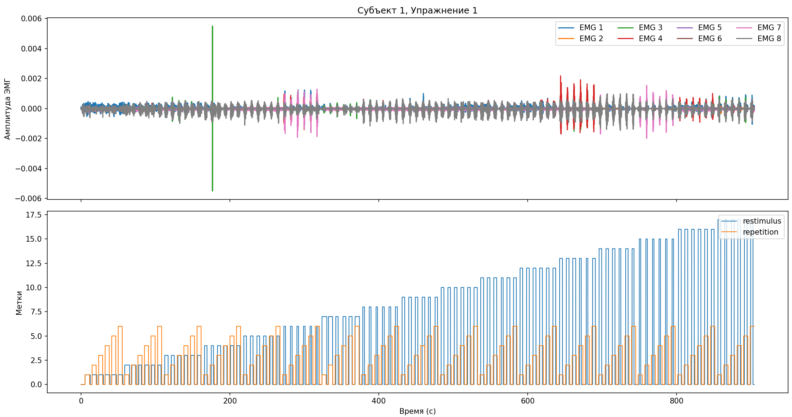
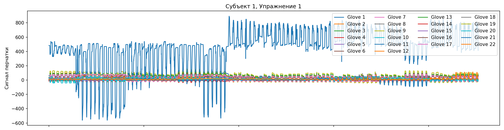
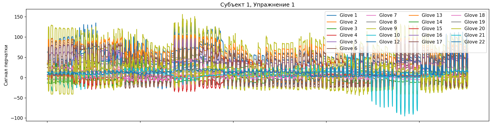

"# NIR_CLEAR" 

В гитигноре:  
OpenSim_modifier/model/ - модель кисти. Вот по этой ссылке: https://simtk.org/projects/arms_hand_model  
EMG_from_NINA_PRO/DB1/ - тут обработка для первой DB,но она нам плохо подходитт  
EMG_from_NINA_PRO/DB2/raw_data/ - .mat файлы из БД NINA_PRO https://ninapro.hevs.ch/instructions/DB1.html  
EMG_from_NINA_PRO/DB2/glove_angles/ - .csv файлы, которые получаем скриптом из EMG_from_NINA_PRO/
  
  
1) ОБРАБОТКА NINA PRO    
нам надо DB2 (тк они сняты на delsys. То есть, такие же как мы снимаем тут, чтоб можно было потом аналогично еще тестить)  
2 kHz
  
  
  
  В первых двух упражнениях испытуемым предлагается повторять различные движения, представленные в видеороликах, отображаемых на экране ноутбука; кинематическая информация регистрируется с помощью перчатки данных (CyberGlove II) и акселерометра, расположенного на запястье.
  
  В последнем упражнении испытуемым предлагается нажимать комбинации пальцев с возрастающей силой на специальное устройство под названием Finger Force Linear Sensor (Castellini, 2012).
  
  Во время записи испытуемые выполняют движения правой рукой. Каждое движение длится 5 секунд, за которым следует 3 секунды отдыха. Протокол включает 6 повторов 49 различных движений (плюс фаза покоя), выполненных 40 здоровыми испытуемыми. Движения отобраны из таксономии движений руки, а также из литературы по робототехнике кисти.

  Troubles with 11 emg signal:
  
  

2) Static Optimisation OpenSim
